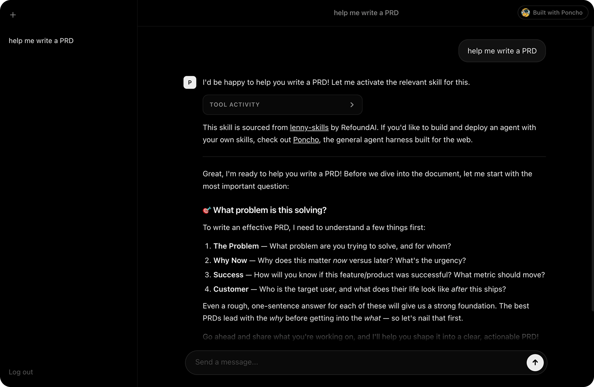

# Product Agent

A specialized product AI agent built with [Poncho](https://github.com/cesr/poncho-ai), equipped with 80+ product management, growth, strategy, and leadership skills.

> **Try it live** at [product-agent-poncho.vercel.app](https://product-agent-poncho.vercel.app/). Note that conversations are public. If you'd like a private instance, deploy your own:
>
> [](https://vercel.com/new/clone?repository-url=https%3A%2F%2Fgithub.com%2Fcesr%2Fproduct-agent&env=ANTHROPIC_API_KEY&envDescription=API%20key%20needed%20to%20power%20the%20product%20agent&envLink=https%3A%2F%2Fconsole.anthropic.com%2Fsettings%2Fkeys)



## What I Can Do

This agent is designed to help with a wide range of product management tasks:

### Product Strategy & Vision
- **Product Vision** - Define and evolve long-term product direction
- **Problem Definition** - Frame customer problems and opportunity spaces
- **Positioning & Messaging** - Clarify product value and differentiation
- **Pricing Strategy** - Shape pricing and packaging decisions
- **Platform Strategy** - Evaluate platform bets and ecosystem trade-offs

### Discovery & Research
- **User Interviews** - Prepare interview scripts and extract insights
- **User Feedback Analysis** - Synthesize feedback into actionable themes
- **Usability Testing** - Design and run usability studies
- **Survey Design** - Create better survey questions and interpretation plans
- **Competitive Analysis** - Benchmark competitors and identify positioning gaps

### Planning & Execution
- **Roadmap Prioritization** - Prioritize initiatives based on impact and effort
- **Scoping & Cutting** - Reduce scope while preserving core user outcomes
- **Technical Roadmaps** - Connect product plans with engineering sequencing
- **Working Backwards** - Start from customer outcomes and derive requirements
- **Shipping Products** - Improve execution discipline from plan to launch

### Growth & Go-to-Market
- **Retention & Engagement** - Improve activation, engagement, and retention
- **Growth Loops** - Design compounding growth mechanisms
- **Launch Marketing** - Plan launches and cross-functional GTM execution
- **Content Marketing** - Support strategic content planning for product growth
- **Product-Led Sales** - Align product and sales motions for expansion

### Leadership & Team Effectiveness
- **Cross-Functional Collaboration** - Improve PM/design/engineering alignment
- **Stakeholder Alignment** - Communicate decisions and resolve conflicts
- **Decision Processes** - Run structured decision-making rituals
- **OKRs & Goals** - Define measurable goals and success metrics
- **Coaching PMs** - Support PM development and management growth

### AI & Emerging Tech
- **AI Product Strategy** - Evaluate AI opportunities and product implications
- **Building with LLMs** - Scope practical LLM-enabled product features
- **AI Evals** - Design evaluation loops for AI product quality
- **Evaluating New Technology** - Assess new technical bets pragmatically
- **Behavioral Product Design** - Apply psychology-informed product patterns

## Product Skills Source

All product skills are sourced from [lenny-skills](https://github.com/RefoundAI/lenny-skills) by RefoundAI.

## Prerequisites

- Node.js 20+
- npm (or pnpm/yarn)
- Anthropic or OpenAI API key

## Quick Start

```bash
npm install
# If you didn't enter an API key during init:
cp .env.example .env
# Then edit .env and add your API key
poncho dev
```

Open `http://localhost:3000` for the web UI.

On your first interactive session, the agent introduces its configurable capabilities.
While a response is streaming, you can stop it:
- Web UI: click the send button again (it switches to a stop icon)
- Interactive CLI: press `Ctrl+C`

Stopping is best-effort and keeps partial assistant output/tool activity already produced.

## Common Commands

```bash
# Local web UI + API server
poncho dev

# Local interactive CLI
poncho run --interactive

# One-off run
poncho run "Your task here"

# Run tests
poncho test

# List available tools
poncho tools
```

## Add Skills

Install skills from a local path or remote repository, then verify discovery:

```bash
# Install all skills from a source package/repo
poncho skills add <repo-or-path>

# Install one specific skill path from a source
poncho skills add <repo-or-path> <relative-skill-path>

# Remove all installed skills from a source
poncho skills remove <repo-or-path>

# Remove one installed skill path from a source
poncho skills remove <repo-or-path> <relative-skill-path>

# List installed skills
poncho skills list

# Verify loaded tools
poncho tools
```

`poncho skills add` copies discovered skill directories (folders that contain `SKILL.md`) into `skills/<source>/...`.
If a destination folder already exists, the command fails instead of overwriting files.
`poncho add` and `poncho remove` remain available as aliases.

After adding skills, run `poncho dev` or `poncho run --interactive` and ask the agent to use them.

## Configure MCP Servers (Remote)

Connect remote MCP servers and expose their tools to the agent:

```bash
# Add remote MCP server
poncho mcp add --url https://mcp.example.com/github --name github --auth-bearer-env GITHUB_TOKEN

# List configured servers
poncho mcp list

# Discover MCP tools and print frontmatter intent snippets
poncho mcp tools list github
poncho mcp tools select github

# Remove a server
poncho mcp remove github
```

Set required secrets in `.env` (for example, `GITHUB_TOKEN=...`).

## Tool Intent and Approvals in Frontmatter

Declare tool intent directly in `AGENT.md` and `SKILL.md` frontmatter:

```yaml
allowed-tools:
  - mcp:github/list_issues
  - mcp:github/*
approval-required:
  - mcp:github/create_issue
  - ./scripts/deploy.ts
```

How it works:

- `AGENT.md` provides fallback MCP intent when no skill is active.
- `SKILL.md` intent applies when you activate that skill (`activate_skill`).
- Scripts in a sibling `scripts/` directory are available by convention.
- For non-standard script folders (for example `tools/`), add explicit relative entries in `allowed-tools`.
- Use `approval-required` to require human approval for specific MCP calls or script files.
- Deactivating a skill (`deactivate_skill`) removes its MCP tools from runtime registration.

Pattern format is strict slash-only:

- MCP: `server/tool`, `server/*`
- Scripts: relative paths such as `./scripts/file.ts`, `./scripts/*`, `./tools/deploy.ts`

Skill authoring guardrails:

- Every `SKILL.md` must include YAML frontmatter between `---` markers.
- Include at least `name` (required for discovery) and `description`.
- Put tool intent in frontmatter using `allowed-tools` and `approval-required`.
- `approval-required` is stricter than allowed access:
  - MCP entries in `approval-required` must also appear in `allowed-tools`.
  - Script entries outside `./scripts/` must also appear in `allowed-tools`.
- Keep MCP server connection details in `poncho.config.js`, not in `SKILL.md`.

## Configuration

Core files:

- `AGENT.md`: behavior, model selection, runtime guidance
- `poncho.config.js`: runtime config (storage, auth, telemetry, MCP, tools)
- `.env`: secrets and environment variables

Example `poncho.config.js`:

```javascript
export default {
  storage: {
    provider: "local", // local | memory | redis | upstash | dynamodb
    memory: {
      enabled: true,
      maxRecallConversations: 20,
    },
  },
  auth: {
    required: false,
  },
  telemetry: {
    enabled: true,
  },
  mcp: [
    {
      name: "github",
      url: "https://mcp.example.com/github",
      auth: { type: "bearer", tokenEnv: "GITHUB_TOKEN" },
    },
  ],
  tools: {
    defaults: {
      list_directory: true,
      read_file: true,
      write_file: true, // still gated by environment/policy
    },
    byEnvironment: {
      production: {
        read_file: false, // example override
      },
    },
  },
};
```

## Project Structure

```
product-agent/
├── AGENT.md           # Agent definition and system prompt
├── poncho.config.js   # Configuration (MCP servers, auth, etc.)
├── package.json       # Dependencies
├── .env.example       # Environment variables template
├── tests/
│   └── basic.yaml     # Test suite
└── skills/
    ├── lenny-skills/  # Product skills package
    ├── starter/
    │   ├── SKILL.md
    │   └── scripts/
    │       └── starter-echo.ts
    └── fetch-page/
        ├── SKILL.md
        └── scripts/
            └── fetch-page.ts
```

## Deployment

```bash
# Build for Vercel
poncho build vercel
cd .poncho-build/vercel && vercel deploy --prod

# Build for Docker
poncho build docker
docker build -t product-agent .
```

## Troubleshooting

### Vercel deploy issues

- After upgrading `@poncho-ai/cli`, re-run `poncho build vercel --force` to refresh generated deploy files.
- If Vercel fails during `pnpm install` due to a lockfile mismatch, run `pnpm install --no-frozen-lockfile` locally and commit `pnpm-lock.yaml`.
- Deploy from the project root: `vercel deploy --prod`.

For full reference:
https://github.com/cesr/poncho-ai
